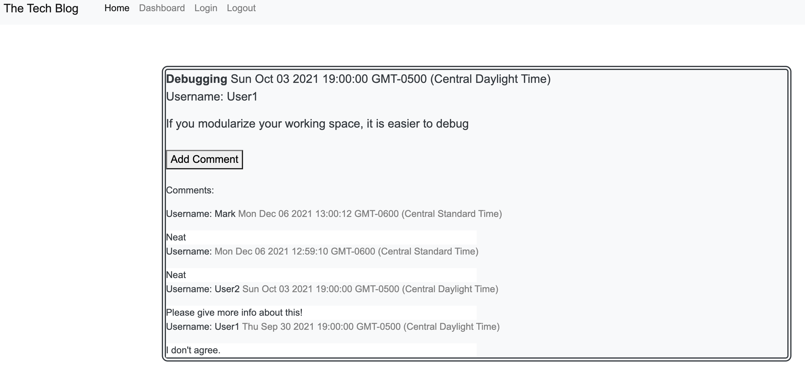

# MVC: Tech Blog    

  ## Table of contents
  1. [Description](#description)
  2. [Installation](#installation)
  3. [Usage](#usage)
  4. [Contributing](#contributing)
  5. [Tests](#tests)
  6. [Questions](#questions)

  ## Description 

  Built a CMS-style blog site similar to Wordpress,where developers can publish their blog posts and comment on other developers’ posts as well. The app follows the MVC paradigm in its architectural structure, using Handlebars.js as the templating language, Sequelize as the ORM, and the express-session npm package for authentication

  ## Installation 

  Navigate to the folder repo in terminal, change to db'cd db', type 'mysql -u root -p', enter your password, type 'source schema.sql', type 'exit', then navigate up 'cd ..', run seeds 'npm run sed' and finally 'node server.js', it should be working on localhost 3004.

  ## Usage 

  It can be used for projects related with blogs if you want a community to exchange tips and comment over a subject.

  ## Contributing 

  Anyone willing to contribute can do it.

  ## Tests 

  N/A

  ## License

  This project works under a license of type MIT. For more information regarding the license, follow the link https://opensource.org/licenses/MIT

  ## Questions 

  For additional information or any questions regarding the project, please feel free to contact me via GitHub or email.
  GitHub: MarcoTorr
  Email: marco.torres@aiesec.net

  ## Preview

  